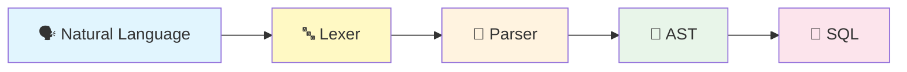

<div align="center">

# 🗣️ Natural Language to SQL Parser

### *Transform plain English into powerful SQL queries*

[](https://nextjs.org/)
[](https://python.org/)
[](https://typescriptlang.org/)
[](https://tailwindcss.com/)


**Frontend ✅ | Backend ✅ | Parser Pipeline ✅**

</div>

---

## 📖 Table of Contents

- [Overview](#-overview)
- [Demo](#-demo)
- [Architecture](#-architecture)
- [Installation](#-installation)
- [Usage](#-usage)
- [Supported Queries](#-supported-queries)
- [Project Structure](#-project-structure)
- [Team](#-team)
- [License](#-license)

---

## 🎯 Overview

A modern web application that converts **natural language queries** into **SQL statements**, making database querying accessible to everyone — no SQL knowledge required!

### ✨ Key Features

| Feature | Description |
|---------|-------------|
| 🧠 **Smart Parsing** | 3-stage pipeline: English → DSL → AST → SQL |
| 💬 **Chat Interface** | Beautiful messenger-style UI |
| ⚡ **Real-time** | Instant SQL generation |
| 📱 **Responsive** | Works on desktop & mobile |
| 🎨 **Modern UI** | Tailwind CSS with smooth animations |

---

## 🎬 Demo

```
┌─────────────────────────────────────────────────────────────┐
│  💬 Chat Interface                                          │
├─────────────────────────────────────────────────────────────┤
│                                                             │
│  👤 You: "select all users where age greater than 20"       │
│                                                             │
│  🤖 Bot: SELECT * FROM users WHERE age > 20                 │
│                                                             │
│  👤 You: "count products"                                   │
│                                                             │
│  🤖 Bot: SELECT COUNT(*) FROM products                      │
│                                                             │
└─────────────────────────────────────────────────────────────┘
```

---

## 🏗️ Architecture



### Pipeline Stages (Compiler Architecture)

| Stage | Component | Input | Output | Description |
|-------|-----------|-------|--------|-------------|
| **1️⃣** | **Lexer** | `"select all from users"` | `[SELECT, ALL, FROM, IDENTIFIER]` | Lexical analysis - tokenize input |
| **2️⃣** | **Parser** | `Tokens[]` | `SelectNode(...)` | Syntax analysis - build parse tree |
| **3️⃣** | **AST** | `SelectNode` | `AST structure` | Abstract Syntax Tree representation |
| **4️⃣** | **SQL Gen** | `AST` | `SELECT * FROM users;` | Code generation - output SQL |

### Detailed Flow

```
┌──────────────────────────────────────────────────────────────────────────────┐
│                        LEXER → PARSER → AST → SQL                            │
├──────────────────────────────────────────────────────────────────────────────┤
│                                                                              │
│   Input: "select all products where price greater than 100"                  │
│                              ▼                                               │
│   ┌──────────────────────────────────────────────────────────────────┐       │
│   │  LEXER (Lexical Analysis)                                        │       │
│   │  Tokens: [SELECT, ALL, IDENTIFIER(products), WHERE,              │       │
│   │           IDENTIFIER(price), GREATER, NUMBER(100)]               │       │
│   └──────────────────────────────────────────────────────────────────┘       │
│                              ▼                                               │
│   ┌──────────────────────────────────────────────────────────────────┐       │
│   │  PARSER (Syntax Analysis)                                        │       │
│   │  SelectNode(columns=['*'], table='products',                     │       │
│   │             where=SimpleCondition(col='price', op='>', val=100)) │       │
│   └──────────────────────────────────────────────────────────────────┘       │
│                              ▼                                               │
│   ┌──────────────────────────────────────────────────────────────────┐       │
│   │  SQL GENERATOR                                                   │       │
│   │  Output: SELECT * FROM products WHERE price > 100;               │       │
│   └──────────────────────────────────────────────────────────────────┘       │
│                                                                              │
└──────────────────────────────────────────────────────────────────────────────┘
```

---

## 🚀 Installation

### Prerequisites

```bash
✅ Node.js 16+
✅ Python 3.8+
✅ npm or yarn
```

### Quick Start

```bash
# 1️⃣ Clone repository
git clone <repository-url>
cd Natural-Language-Command-to-SQL-Parser

# 2️⃣ Install dependencies
npm install

# 3️⃣ Start development server
npm run dev

# 4️⃣ Open browser
# → http://localhost:3000
```

---

## 💬 Usage

### Supported Query Types

<details>
<summary><b>📋 SELECT Queries</b></summary>

```sql
-- Input: "select all from users"
SELECT * FROM users

-- Input: "show all products where price > 100"
SELECT * FROM products WHERE price > 100

-- Input: "select name from users where age > 20"
SELECT name FROM users WHERE age > 20
```
</details>

<details>
<summary><b>🔢 Aggregate Functions</b></summary>

```sql
-- Input: "count users"
SELECT COUNT(*) FROM users

-- Input: "how many products"
SELECT COUNT(*) FROM products

-- Input: "sum price from orders"
SELECT SUM(price) FROM orders
```
</details>

<details>
<summary><b>🔗 Multiple Conditions</b></summary>

```sql
-- Input: "select users where age > 20 and salary < 5000"
SELECT * FROM users WHERE (age > 20 AND salary < 5000)

-- Input: "show products where price > 100 or stock < 10"
SELECT * FROM products WHERE (price > 100 OR stock < 10)
```
</details>

<details>
<summary><b>📊 ORDER BY / GROUP BY</b></summary>

```sql
-- Input: "select all products order by price desc"
SELECT * FROM products ORDER BY price DESC

-- Input: "select department from employees group by department"
SELECT department FROM employees GROUP BY department
```
</details>

<details>
<summary><b>✏️ INSERT / UPDATE / DELETE</b></summary>

```sql
-- Input: "insert into users values 1, 'Nam', 22"
INSERT INTO users VALUES (1, 'Nam', 22)

-- Input: "update users set age = 25 where id = 10"
UPDATE users SET age = 25 WHERE id = 10

-- Input: "delete from users where id = 5"
DELETE FROM users WHERE id = 5
```
</details>

<details>
<summary><b>🎯 Advanced Queries</b></summary>

```sql
-- DISTINCT
-- Input: "select distinct city from users"
SELECT DISTINCT city FROM users

-- BETWEEN
-- Input: "select users where age between 20 and 30"
SELECT * FROM users WHERE age BETWEEN 20 AND 30

-- IN
-- Input: "select users where id in 1,2,5"
SELECT * FROM users WHERE id IN (1, 2, 5)

-- LIKE
-- Input: "find users where name contains 'an'"
SELECT * FROM users WHERE name LIKE '%an%'

-- ALTER TABLE
-- Input: "delete column age from users"
ALTER TABLE users DROP COLUMN age
```
</details>

---

## 📁 Project Structure

```
📦 Natural-Language-Command-to-SQL-Parser
├── 📂 python/                     # 🐍 Backend Parser
│   ├── 📄 lexer.py               # 🔤 Lexical Analyzer (Tokenizer)
│   ├── 📄 syntax_parser.py       # 📝 Syntax Analyzer (Parser → AST)
│   ├── 📄 pipeline.py            # 🔗 Complete Pipeline (Lexer → Parser → SQL)
│   └── 📄 parser.py              # 🧠 Main entry point for API
│
├── 📂 src/app/                    # ⚛️ Next.js Frontend
│   ├── 📄 page.tsx               # 🏠 Main page
│   ├── 📂 api/parse/
│   │   └── 📄 route.ts           # 🔌 API endpoint
│   ├── 📂 components/
│   │   ├── 📄 Chat.tsx           # 💬 Chat UI
│   │   ├── 📄 Magnifier.tsx      # 🔍 Animations
│   │   ├── 📄 StartButton.tsx    # ▶️ Start button
│   │   └── 📄 Icons.tsx          # 🎨 SVG icons
│   └── 📂 services/
│       └── 📄 sqlParser.ts       # 📡 API client
│
├── 📄 package.json
├── 📄 tsconfig.json
└── 📄 README.md
```

### Python Modules Description

| File | Purpose |
|------|---------|
| `lexer.py` | Tokenizes natural language input into tokens (SELECT, FROM, WHERE, etc.) |
| `syntax_parser.py` | Parses token stream into AST using recursive descent |
| `pipeline.py` | Integrates all stages: Lexer → Parser → AST → SQL |
| `parser.py` | Main entry point, handles CLI and API integration |

---

## 🧪 Testing

```bash
# Run complete pipeline test
python python/pipeline.py

# Test individual query
python python/parser.py "select all from users"

# Test lexer only
python python/lexer.py

# Test parser only
python python/syntax_parser.py
```

### Test Results (15/15 Passing)

```
✅ PASS: select all from users
✅ PASS: show all products where price > 100
✅ PASS: select users where age > 20 and salary < 5000
✅ PASS: select products where price between 10 and 100
✅ PASS: count users
✅ PASS: how many products
✅ PASS: insert into users values 1, 'John', 25
✅ PASS: update users set age = 25 where id = 10
✅ PASS: delete from users where id = 5
✅ PASS: find users where name contains 'an'
✅ PASS: select distinct city from customers
✅ PASS: select all products order by price desc
✅ PASS: delete column age from users
✅ PASS: alter table users drop column age
✅ PASS: show all products from inventory
```
━━━━━━━━━━━━━━━━━━━━━━━━━━━━━━━━
Results: 16 passed, 0 failed ✅
```

---

## 👥 Team

<table>
<tr>
<td align="center" width="33%">
<b>Tín</b><br>
<sub>English → DSL</sub><br>
<sub>Rule-based pattern matching</sub>
</td>
<td align="center" width="33%">
<b>T</b><br>
<sub>DSL → Parser/AST</sub><br>
<sub>Abstract Syntax Tree</sub>
</td>
<td align="center" width="33%">
<b>Quân</b><br>
<sub>AST → SQL + Frontend</sub><br>
<sub>Code generation & UI</sub>
</td>
</tr>
</table>

---

## 🔮 Roadmap

- [ ] 🎤 Voice input support
- [ ] 🗄️ Database connection & execution
- [ ] 📊 Schema awareness
- [ ] 📜 Query history
- [ ] 🌐 Multi-language (Vietnamese)

---

## 📚 Resources

| Resource | Link |
|----------|------|
| Next.js Docs | [nextjs.org/docs](https://nextjs.org/docs) |
| Tailwind CSS | [tailwindcss.com](https://tailwindcss.com/docs) |
| Python re module | [docs.python.org](https://docs.python.org/3/library/re.html) |

---

## 📝 License

This project is open source and available under the [MIT License](LICENSE).

---

<div align="center">

### 📅 Development Timeline

| Date | Milestone |
|------|-----------|
| Dec 12, 2025 | Frontend development |
| Dec 22, 2025 | Backend parser completion |

---


**Made with ❤️ for PPL Project**

⭐ Star this repo if you find it helpful!

</div>
